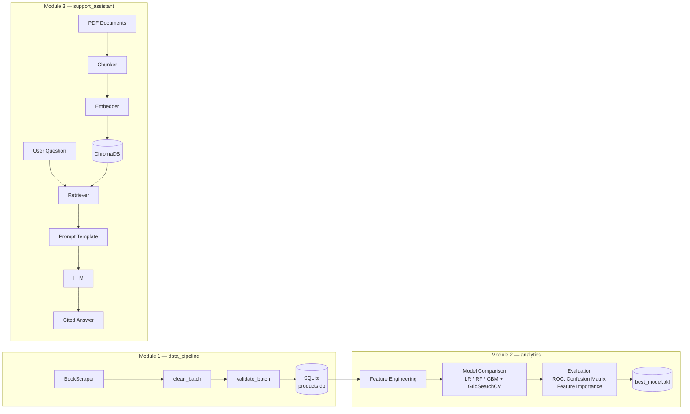

# E-Commerce Intelligence Platform

A three-module portfolio project: scrape a product catalog, analyze
it to predict high-performing titles, and answer questions about it
through a RAG assistant. Each module is independently runnable and
independently tested, but they share one story and one dataset.

## Architecture



## Folder structure

```
/
├── data_pipeline/       # Module 1 — scrape, clean, validate, persist
├── analytics/           # Module 2 — EDA, modeling, evaluation, case-study notebook
├── support_assistant/   # Module 3 — RAG assistant (CLI + FastAPI)
├── requirements.txt
├── .env.example
└── .gitignore
```

Each module has its own README with full details:
[`data_pipeline/README.md`](data_pipeline/README.md) ·
[`analytics/README.md`](analytics/README.md) ·
[`support_assistant/README.md`](support_assistant/README.md)

## Installation & setup

```bash
git clone <this-repo>
cd ecommerce-intel-platform
python -m venv .venv && source .venv/bin/activate
pip install -r requirements.txt
cp .env.example .env   # adjust as needed
```

## Running every module

```bash
# Module 1 — populate the database
python -m data_pipeline.main                       # live scrape
python -m data_pipeline.seed_synthetic_data         # or: synthetic seed data

# Module 2 — run the full analysis
python -m analytics.run_analysis
jupyter notebook analytics/notebooks/analysis.ipynb # narrative version

# Module 3 — RAG assistant
python -m support_assistant.cli ingest
python -m support_assistant.cli chat
uvicorn support_assistant.api.app:app --reload      # or: HTTP API
```

## Tests

```bash
pytest data_pipeline/tests/ analytics/tests/ support_assistant/tests/ -v
```

35 tests total, all passing, all against real fixtures / in-memory
databases / offline fallbacks — no mocked-away assertions.

## Example output

**Module 1** — 15/15 tests passing; scraper implemented against
books.toscrape.com with two-hop enrichment (listing + detail page).

**Module 2** — executed 28-cell notebook; model comparison table,
ROC curves, confusion matrix, and feature importance plots generated
from a real (synthetic-seed) run — see `analytics/outputs/`.

**Module 3** — full RAG round-trip verified end-to-end in this build,
including the FastAPI endpoints via `TestClient`:

```
Q: What payment methods are accepted?
A: Payment Methods
   We accept Visa, Mastercard, American Express, and PayPal. Payment
   is charged at the time of order placement, not at shipment...
Sources: [('support_faq.pdf', page 1), ...]
```

## Design decisions

- **Repository pattern** (Module 1) and **provider abstraction**
  (Module 3, both embeddings and LLM) are the two recurring patterns
  across this codebase: depend on a small interface, not a specific
  library, so swapping implementations is a config change, not a
  rewrite.
- **Synthetic seed data (Module 2) and offline fallbacks (Module 3
  embeddings/LLM)**: this repository was built in a sandboxed
  environment whose network allowlist excludes both
  `books.toscrape.com` and `huggingface.co`/LLM APIs. Rather than
  fabricate results or leave code unexecuted, every module includes
  a dependency-free path that was actually run and verified here —
  clearly documented in each module's README — while the production
  code paths (live scraping, Sentence-Transformers, OpenAI/Gemini/
  Ollama) are fully implemented and are a one-line config change away
  on an unrestricted network.
- **SQLite over PostgreSQL** for zero-setup reproducibility; the
  connection string is the only thing that changes to move to
  Postgres (`data_pipeline/database/connection.py`).

## Future improvements

- CI pipeline (GitHub Actions) running all three test suites and the
  analytics notebook on push.
- Author-level and multi-snapshot time-series features in Module 2.
- SHAP-based per-prediction explainability for the classifier.
- Streaming responses and multi-turn memory persistence (currently
  in-process only) for Module 3.
- Docker Compose tying all three modules together with a shared
  Postgres + a real vector DB service.
